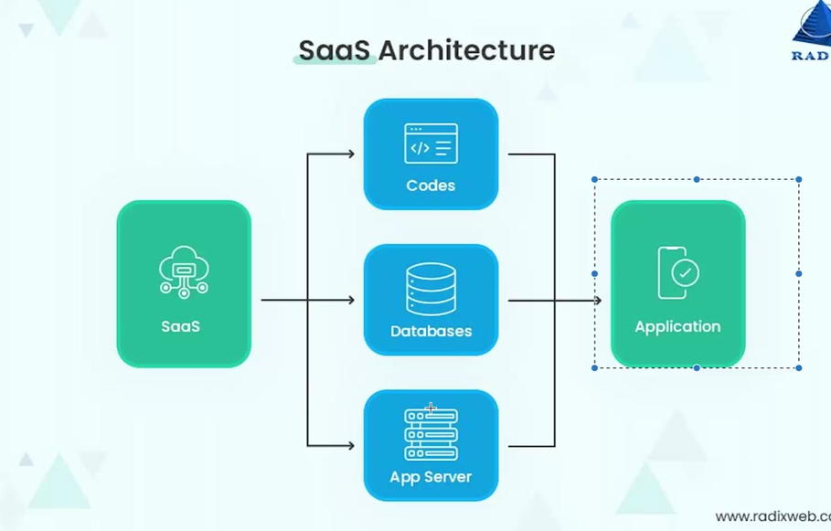
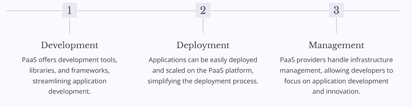
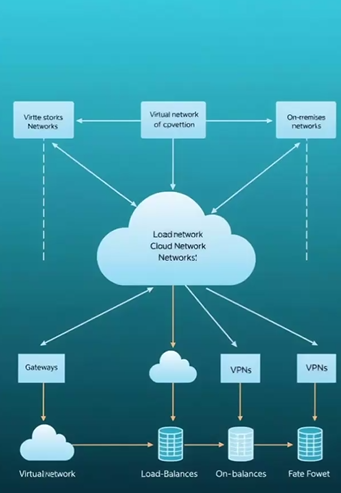
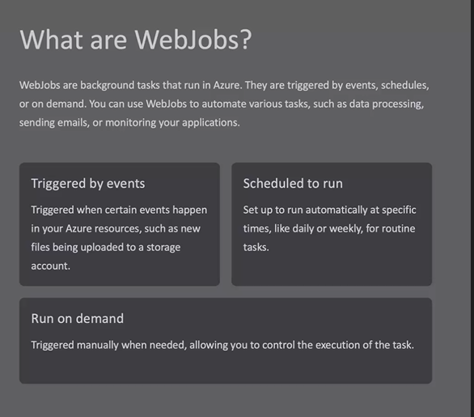
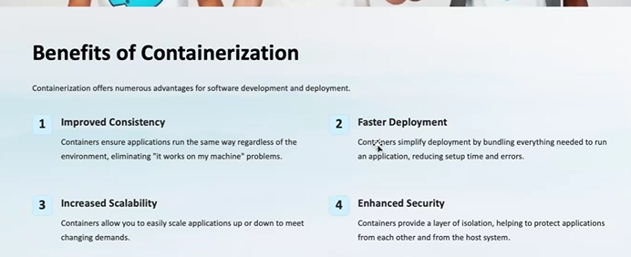
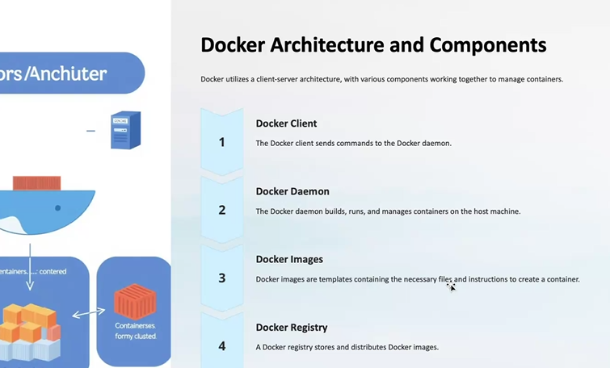
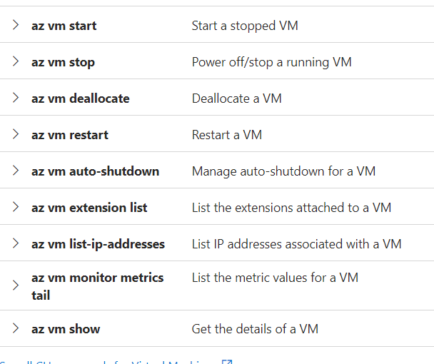
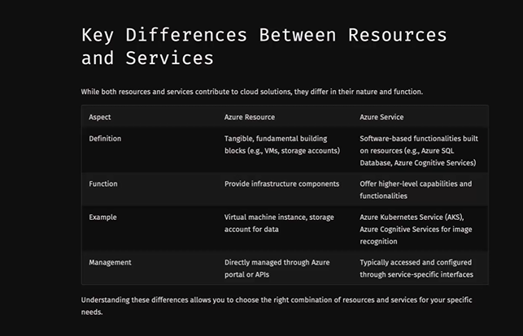

# WHAT IS CLOUD COMPUTING

- to meet the needs of increasing number of users
- to reduce cost
- to manage large amount of data
- pay as you go
- serverless computing 
- infinite storage
- applications can be deployed

- Types of cloud
1. private cloud
2. public cloud 
3. Hybrid cloud   

- Auto Scaling Group (ASG) - if enabled the project will be using auto scaling  

- Active Directory - usernames , passwords are stored in AD. 

## SOFTWARE AS A SERVICE
- the user intervention is less
1. Accessiblity
2. Scalability
3. COst effectiveness

## INFRASTRUCTURE AS A SERVICE 

- provides virtualized computing resources such as servers and networking on demand

1. Control - users have great control
2. FLexibility - offers flexibity in resource allocation, scale up or scale down as needed
3. Cost-efficiency

## PLATFORM AS A SERVICE

- provides a cloud based platfrom for developing, deploying and managing applications without complexities 

1. Development 
2. Deployment - testing -> SIT, UAT
3. Management - production -> pre production and production

- we can also combine Iaas, Saas, PaaS

- in abstration , Saas is at highest level , Paas Medium, Iaas lowest

## CHOOSING RIGHT CLOUD MODEL

- Application Complexity -> based on the type of users using the application, turnaround complexity, storage. => Saas is suitable for simpler applications while Paas and Iaas for more complex applications
- control requirements  -> Iaas offers the most control over infrastruture, while Saas provides least
- budget constraints -> Saas has lower upfront cost while Iaas and Paas can have  higher costs.

## Parameters to define whether Iaas,Paas or Saas

1. Severless?
2. deployment - if no then not Paas
3. Application - if yes then Iaas or Saas
4. behaviour
5. infrastructure 

# MICROSOFT AZURE

- cloud platform 
- provides a flexible and sclable platform for businesses of all sizes 

## SERVICES 

1. Compute - VM,Serverless computing, containers ( execute a application on a serverless machine)
2. Storage - blobs,files, queues,tables and disks 
3. Networking - virtual nwtorks , load balancers,vpn gateways for connectivity
4. Security

### AZURE COMPUTE 

- VMs - ondemand, scalable compute instances with a choice of operating system 
- Containers - deploy, manage containerized apps with azure containerized service
- Serverless Computing - run code without managing servers using Azure functions and Azure Logic apps.

### AZURE STORAGE 

- Blob Storage - stores unstructured data like images , vidoes

- File Storage - shares files across diff applications and users

- Queue Storage - handles asynchronous messaging b/w applications

- Table Storage - NoSQL database for structured data 

### AZURE NETWORKING 

- Virtual Networks - private networks in cloud, isolating applications and resources
- Load Balancers - distribute trafiic across multiple instances for high availability 
- VPN Gateways - connect on-premises networks to azure 
 

### AZURE SECURITY 

1. Identity Management : Azure Active Directory is used for user authentication (when we login) and authorization(permissions after login)
2. Data Encryption : encrypt data at rest and in transit using Azure Key Vault
3. Threat Protection : Azure Security Center for monitoring and responding to security threats

- Azure Monitoring - Log analytics(Collect and analyze logs of azure) , Metrics(monitor metrics of azure resources and applications) and Alerts(sets alerts for critical events )

- Active Directory : 
https://www.microsoft.com/en-in/security/business/identity-access/microsoft-entra-id

## AZURE WEB JOBS

- Monitoring is done using azure web jobs 
- when we are using a service , events are triggered
- Web jobs are background tasks that run in azure 
- web jobs are triggered by events , schedules or on demand

- Benifits
1. improved efficiency
2. reduced costs
3. flexibility
4. increased scalability

- Types 
1. Continous WebJobs : runs continously as long as they are active, ideal for monitoring
2. Triggered WebJobs : Activatd by specific events such as new files in storage acccount or msgs in queue
3. Scheduled WebJobs : executed according to a defined schedule, suitable for tasks requiring regular execution.

- Deploying WebJobs in Azure
1. Create a WebJob
2. Configure Settings
3. Publish to Azure

# CONTAINERS

- includes everything needed to run an application:code,libraries,system,tools and configuration settings.

- benefits

- Docker : makes the projects independent of platform , to run our applications irrespective of operating system 

- docker is a container engine

- docker engine : image building, container creation , container management

- docker hub : cloud for sharing and storing docker images

- docker compose : manages dependencies and relationships 

- Docker Architecture 

- Commands for Virtual Machine

- webapp-sql.json => azure resource manager file  

- Building Docker Images
1. From - specifies the base iamge to use for build
2. Copy - 
3. Run -
4. CMD - sets the default command to run when the container starts

- docker run - creates and runs containers
- docker ps - List all running containers
- docker stop
- docker start
- docker rm - remove a container

- Azure Cosmos DB - no sql database 

# SHARED RESPONSIBILITY MODEL

- the security tasks are divided between cloud provider and user
- division is based on the cloud model
- Availability Zone : the cloud providor checks whether the application is running in that particular zone or not , if one zone experiences outage , then other zones handle .
- region can contain multiple availability zones.

- Resource Group : group of related resources together, so that they can be managed as single entity 

- services are subcategories of resource

- example VM is a service of windows machine 

# DEVOPS
- development + opearations => deploying code 
- main branch -> flawless code is pushed 
- the code is deployed from main branch 
- github is a source code managmenent tool
- dev -> test -> preprod -> main(prod) (flow of branches)
- pull request is raised when we want to push from one branch to another
- ITSM -> IT service manager ensures the deploymnent from one layer to another (from development layer to testing layer to production )
- three categories (deployment Pipeline)
1. SCM
2. Staging
3. Deployment

- continous integration / continous deployment : CI where developers regularly merge their code changes into a central repository 

- triggers are stimulations that triggers deployment , automatically starts a pipeline run

# ARM
 - Azure Resource Manager is the deployment and management service for Azure. It provides a management layer that enables you to create, update, and delete resources in your Azure account. You use management features, like access control, locks, and tags, to secure and organize your resources after deployment. 
 - When you send a request through any of the Azure APIs, tools, or SDKs, Resource Manager receives the request. It authenticates and authorizes the request before forwarding it to the appropriate Azure service.

 - resource groups is similar to branches in github 

 - developer will put his code in a VM at a particular location in that resource group and devOps engineer will take the code from these locations and start the pipeline.

 - we can create resource of a service.
 Eg: we can create a virtual machine service of compute resource
 Eg: we can create cosmos DB of database resource

 - DevOps communicates with ARM and Arm communicates with contianers
 - arm file is created automatically when we deploy an application

 - resource manager applies rules to the resource groups

 - ARM is neither a resource nor a service

 # FACTORS TO CONSIDER WHEN CHOOSING REGIONS

 1. Latency : delay when we are trying to use a service. Minimize latency for users by selecting a region closer to their location.
 2. Data Sovereignty : by selecting regions that meet standards
 3. Pricing : compare pricing across regions 
 4. Avalability Zones : utilizie AZs for high availability by deploying your applications across physically separated data centers within a region.

 - Strategies for Optimizing Region Standards
 1. Geo-Replication : replicate data across multiple regions to ensure availability and disaster recovery
 2. Traffic Routing : Azure Traffic manager to distribute traffic to the optimal region based on performance and availability
 3. Azure Content Delivery Network(CDN) : Cache content closer to end users for faster delivery, improving perforamnce and reducing latency. 

 

