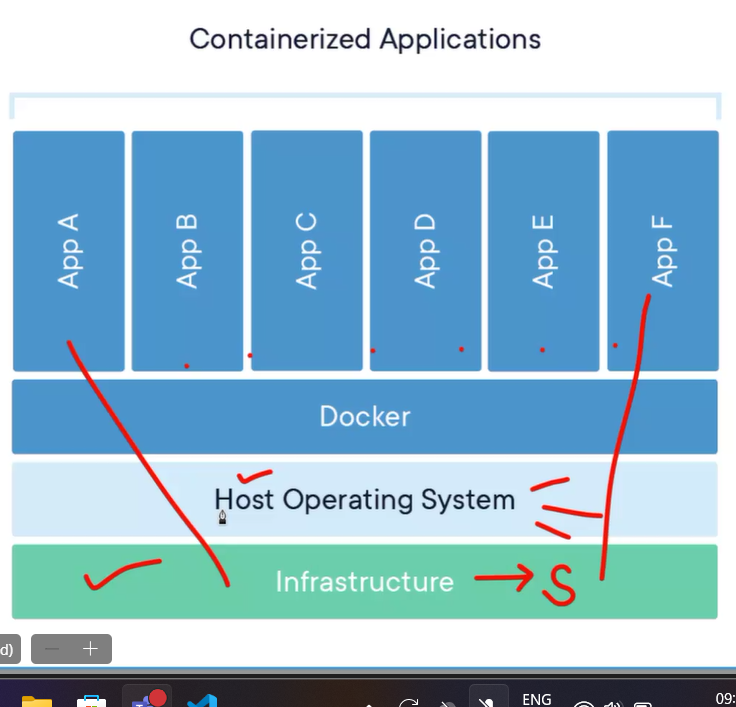

# WHAT IS CLOUD COMPUTING

- to meet the needs of increasing number of users
- to reduce cost
- to manage large amount of data
- pay as you go
- serverless computing 
- infinite storage
- applications can be deployed

- Types of cloud
1. private cloud
2. public cloud 
3. Hybrid cloud   


- Auto Scaling Group (ASG) - if enabled the project will be using auto scaling  

- Active Directory - usernames , passwords are stored in AD. 

## SOFTWARE AS A SERVICE
- the user intervention is less
1. Accessiblity
2. Scalability
3. COst effectiveness


## INFRASTRUCTURE AS A SERVICE 

- provides virtualized computing resources such as servers and networking on demand

1. Control - users have great control
2. FLexibility - offers flexibity in resource allocation, scale up or scale down as needed
3. Cost-efficiency


## PLATFORM AS A SERVICE

- provides a cloud based platfrom for developing, deploying and managing applications without complexities 

1. Development 
2. Deployment - testing -> SIT, UAT
3. Management - production -> pre production and production


- we can also combine Iaas, Saas, PaaS

- in abstration , Saas is at highest level , Paas Medium, Iaas lowest


## CHOOSING RIGHT CLOUD MODEL

- Application Complexity -> based on the type of users using the application, turnaround complexity, storage. => Saas is suitable for simpler applications while Paas and Iaas for more complex applications
- control requirements  -> Iaas offers the most control over infrastruture, while Saas provides least
- budget constraints -> Saas has lower upfront cost while Iaas and Paas can have  higher costs.


## Parameters to define whether Iaas,Paas or Saas

1. Severless?
2. deployment - if no then not Paas
3. Application - if yes then Iaas or Saas
4. behaviour
5. infrastructure 


# MICROSOFT AZURE

- cloud platform 
- provides a flexible and sclable platform for businesses of all sizes 

## SERVICES 

1. Compute - VM,Serverless computing, containers ( execute a application on a serverless machine)
2. Storage - blobs,files, queues,tables and disks 
3. Networking - virtual nwtorks , load balancers,vpn gateways for connectivity
4. Security


### AZURE COMPUTE 

- VMs - ondemand, scalable compute instances with a choice of operating system 
- Containers - deploy, manage containerized apps with azure containerized service
- Serverless Computing - run code without managing servers using Azure functions and Azure Logic apps.


### AZURE STORAGE 

- Blob Storage - stores unstructured data like images , vidoes

- File Storage - shares files across diff applications and users

- Queue Storage - handles asynchronous messaging b/w applications

- Table Storage - NoSQL database for structured data 


### AZURE NETWORKING 

- Virtual Networks - private networks in cloud, isolating applications and resources
- Load Balancers - distribute trafiic across multiple instances for high availability 
- VPN Gateways - connect on-premises networks to azure 
 


### AZURE SECURITY 

1. Identity Management : Azure Active Directory is used for user authentication (when we login) and authorization(permissions after login)
2. Data Encryption : encrypt data at rest and in transit using Azure Key Vault
3. Threat Protection : Azure Security Center for monitoring and responding to security threats


- Azure Monitoring - Log analytics(Collect and analyze logs of azure) , Metrics(monitor metrics of azure resources and applications) and Alerts(sets alerts for critical events )


- Active Directory : 
https://www.microsoft.com/en-in/security/business/identity-access/microsoft-entra-id


## AZURE WEB JOBS

- Monitoring is done using azure web jobs 
- when we are using a service , events are triggered
- Web jobs are background tasks that run in azure 
- web jobs are triggered by events , schedules or on demand

- Benifits
1. improved efficiency
2. reduced costs
3. flexibility
4. increased scalability


- Types 
1. Continous WebJobs : runs continously as long as they are active, ideal for monitoring
2. Triggered WebJobs : Activatd by specific events such as new files in storage acccount or msgs in queue
3. Scheduled WebJobs : executed according to a defined schedule, suitable for tasks requiring regular execution.


- Deploying WebJobs in Azure
1. Create a WebJob
2. Configure Settings
3. Publish to Azure


# CONTAINERS

- includes everything needed to run an application:code,libraries,system,tools and configuration settings.

- benefits


- Docker : makes the projects independent of platform , to run our applications irrespective of operating system 

- docker is a container engine

- docker engine : image building, container creation , container management

- docker hub : cloud for sharing and storing docker images

- docker compose : manages dependencies and relationships 

- Docker Architecture 


- Commands for Virtual Machine


- webapp-sql.json => azure resource manager file  

- Building Docker Images
1. From - specifies the base iamge to use for build
2. Copy - 
3. Run -
4. CMD - sets the default command to run when the container starts


- docker run - creates and runs containers
- docker ps - List all running containers
- docker stop
- docker start
- docker rm - remove a container


- Azure Cosmos DB - no sql database 


# SHARED RESPONSIBILITY MODEL

- the security tasks are divided between cloud provider and user
- division is based on the cloud model
- Availability Zone : the cloud providor checks whether the application is running in that particular zone or not , if one zone experiences outage , then other zones handle .
- region can contain multiple availability zones.


- Resource Group : group of related resources together, so that they can be managed as single entity 

- services are subcategories of resource

- example VM is a service of windows machine 


# DEVOPS
- development + opearations => deploying code 
- main branch -> flawless code is pushed 
- the code is deployed from main branch 
- github is a source code managmenent tool
- dev -> test -> preprod -> main(prod) (flow of branches)
- pull request is raised when we want to push from one branch to another
- ITSM -> IT service manager ensures the deploymnent from one layer to another (from development layer to testing layer to production )
- three categories (deployment Pipeline)
1. SCM
2. Staging
3. Deployment

- continous integration / continous deployment : CI where developers regularly merge their code changes into a central repository 

- triggers are stimulations that triggers deployment , automatically starts a pipeline run


# ARM
 - Azure Resource Manager is the deployment and management service for Azure. It provides a management layer that enables you to create, update, and delete resources in your Azure account. You use management features, like access control, locks, and tags, to secure and organize your resources after deployment. 
 - When you send a request through any of the Azure APIs, tools, or SDKs, Resource Manager receives the request. It authenticates and authorizes the request before forwarding it to the appropriate Azure service.


 - resource groups is similar to branches in github 

 - developer will put his code in a VM at a particular location in that resource group and devOps engineer will take the code from these locations and start the pipeline.


 - we can create resource of a service.
 Eg: we can create a virtual machine service of compute resource
 Eg: we can create cosmos DB of database resource


 - DevOps communicates with ARM and Arm communicates with contianers
 - arm file is created automatically when we deploy an application

 - resource manager applies rules to the resource groups

 - ARM is neither a resource nor a service


 # FACTORS TO CONSIDER WHEN CHOOSING REGIONS

 1. Latency : delay when we are trying to use a service. Minimize latency for users by selecting a region closer to their location.
 2. Data Sovereignty : by selecting regions that meet standards
 3. Pricing : compare pricing across regions 
 4. Avalability Zones : utilizie AZs for high availability by deploying your applications across physically separated data centers within a region.


 - Strategies for Optimizing Region Standards
 1. Geo-Replication : replicate data across multiple regions to ensure availability and disaster recovery
 2. Traffic Routing : Azure Traffic manager to distribute traffic to the optimal region based on performance and availability
 3. Azure Content Delivery Network(CDN) : Cache content closer to end users for faster delivery, improving perforamnce and reducing latency. 


 # MICROSERVICES: Creating small small instances and deploy individually

1. Independent Deployment : microservices can be deployed and updated independently 
2. Technology Diversity : diff services can use different technologies, allowing teams to choose the best tool for the job 
3. Improved Scalability : microservices allow scaling individual services based on demand
4. Resilience and Fault isolation :failures in one service are less likely to impact other services, improving application resilience(failing of one service shouldnt effect other services).


- Challenges:
1. Increased complexity : managing a distributed system with many services can be more complex 
2. Distributed Debugging : tracing requests and errors across multiple services can be challenging.
3. Data Consistency : the data be should be same across multiple services. Maintaining consistency across multiple services requires carefull design and implementation.


## DEVOPS Resources
- Application Insights : to monitor live web application. Must be created before deployment 

- App Configuration : the featurs used to create app in azure environmnet, we can create a app 


# SOLID PRINCIPLES : Design Princles to check  monolithic or microservices application

- Single Responsibility : Each software module or a class should have one and only reason to change. A class should have one and only one reason to change, meaning that a class should have only one job.

- Liskov Substitution :  You should be able to use any derived class instead of a base class without modification. THe actual functionality is substituted with multiple functionalities. Services replace resources.
Before liskov and AFTER liskov


- Open/Closed : a software class or module should be open for extension but closed for modification, when we inherit a class we inherit functionalities from parent to child, the parent class should not be modified as it effects the child class . All services are part of a resource , instead of changing the resource we change the service.

- Dependency Inversion : High classes should not depend on low level classes instead both should depend upon abstraction(data hiding) . should depend only the feature we are using (Eg: if we are using a VM , we should not depend on the resource).Reduces the load .


- Interface Segregation : Client should not be forced to use an interface which is not relevant to it or clients shouldn’t be forced to depend on methods they do not use.


# AZURE DevOps
- Backlog : tasks that are yet to come in upcoming days and we are not working on it.
- Sprints are automatically created in backlog.
- first tasks are assigned to everyone, if the tasks are more than the memebers, then the members can choose a task after completing the assigned task.
- if the task is not completed in given time, the task is pushed to backlog

- repository :

  -  developer doesnt have acess to other branches except dev 
  - we create a project under a organization in azure DevOps
  - and repositories are created in a project
  - branches are created in a repos 
  - branch policy - who handles the things , whether azure should handle it or members of a project 


  ## KURBERNETES

  - contianer orchestration system
  - automates deployment , scaling and management of containerized applications
  - K8S , till kubernetes was introduced there was no open source system, we can connect 8 or multiple of 8 containers 
  - framework for running distributed systems 
  - groups containers into logical units called pods.
  - pods are managed across cluster of nodes (multiple pods)
  
- Architecture: 
 1. Master Node - acess only given to admin(example login module is placed in master node)
 2. Worker Node - dependent on master node, to manage and run pods.
 3. Cluster - consists of multiple worker nodes managed by the master node 

 

 4. Kubelet - runs on each worker node and manages the pods running on that node

 5. Etcd - is a distributed key value store used to  store configuration and state of cluster 

 

 - control plane is used to control the nodes, the developers and devops can change the master node depending on the application.

- to create a resource group using cloud shell
```w
 az group create --name myapp-rg --location eastus
```
- to create a azure container registry - all containers are mapped using key value pair
```
az acr create --resource-group myapp-rg --name mycontainerregistry --sku Basic
```


- to create a kubernetes cluster 
https://learn.microsoft.com/en-us/azure/aks/tutorial-kubernetes-deploy-cluster?tabs=azure-cli


- Kubernetes Services 

1. Service Discovery : 
2. Load Balancing
3. Abstraction
4. Acess control 


- Kubernetes Networking


1. Service Discovery : K8s try to search for the service 
2. Network Policy : set of rules that allows a user to acess a network, some of the pods are accesible in a network while others are not in a same network.Helps to control the communication between pods 
3. Ingress Controllers : manage acess to services within cluster. Routing to internal features


# WHAT TO CONSIDER FOR DEVOPS IN NETWORKING

- quality of network deploymentand update speeds : how much time it took for deploymnet
- Network visibility : which network is accesible by which network
- Network segregation : even though all are in same network , so that they can be accessed separately


- developer interacts with master node, users or list of users can only access application through worker nodes. the job of worker nodes to use the features of master node and make accessible to users.
 

- kubernetes will recognize one micro service at a time, for one microservice it will allocate a pod, application will run in the pod.

- Docker plays the role to identify containers, for containerization. Suppose we have 5 microservices of java and 5 of .NET , instead of creating 10 pods , docker will help to containize the java microservices together and .NET microservices together.

- Container Runtime is docker to identify the conatiners

- Network Proxy-> application runs on different addresses, handled by network proxy

- Kubelet -> process that runs in background when kubernetes run.

- Master node is also called control plane node.

- communication between master and worker is bidirectional because for the collaboration of worker nodes 


- Replica set is used when two worker nodes are dependent on each other and needs to run together. for example fronend and backend are dependent on each other but each pod is for each microservice so they must be deployed separately but at the same time.


- Namespace -> name given to location of application in K8S, inside the pod categorization , to separate dev,pod and test

- Microservice is deployed in three namespces 


# REPLICA SET vs DAEMON SET

- daemon set -> a copy of single pod is deployed across multiple nodes, exactly one replica of each node 
- replica set -> ensures specific replicas of pods are running 


# AKS ARCHITECTURE


- ingress => internally processing of service

- to use all the features at same time , ingress helps
- the services inside the cluster , ingress controls the routing of external requests to kubernetes
- suppose we have a same application running on web app, mobile app and a 3rd party app, and the application from different sources is accessing different services , the routing is handled by ingress.
- collection of routing rules, which particular application will acess which service at a particular point of time.


### INGRESS


- deploymnets happen using private IP
- accessibility happen using public IP
- Load balancer , the number of IP addresses the number of users are using, divides the requests into micro services , using azure kubernetes service 
- load balancer breakdowns the requests to services 
- ingress controller performes ingestion 
- ingestion => we are succesfully able to locate the pod depending on the request. 


### KUBERNETES CONFIGMAPS AND SECRETS


### SCALING AND AUTOSCALING

1. Manual Scaling : adjust the number of replicas of a deployment manually
2. Horizontal Pod Autoscaler(HPA) : automatically scale based on a CPU, memory or custom metrics
3. Vertical Pod Autoscaler (VPA) : automatically adjust resource requests and limits


### KUBERNETES ROLLING UPDATES AND ROLLBACKS


### KUBERNETES MONITORING AND LOGGING

- we have features like grafana and promethus for data feaching 
- kubana is also a tool
-


### SECURITY

- Master node handles authentication and authorization


# AZURE DEVOPS FEATURES


- epic are high level tasks

- epic and features are for production

- stories and tasks are for developers

- stories are non technical explanation of tasks


# DOCKER

  => on premises

- docker in VM is handled by hyvervisor in cloud

 => cloud

- hypervisor 


 


